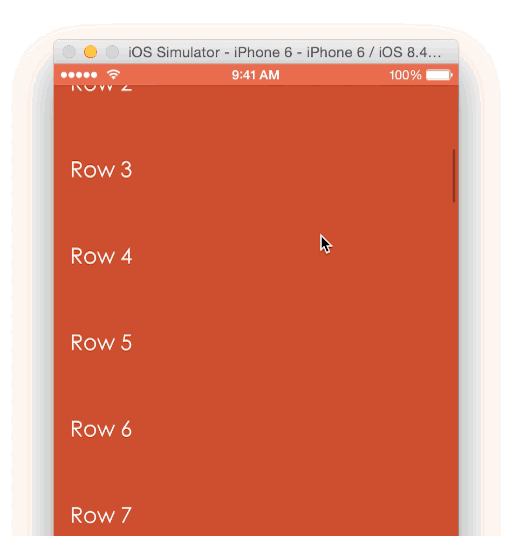

# AMScrollingNavbar_Xamarin.iOS

A custom UINavigationController that enables the scrolling of the navigation bar alongside the
scrolling of an observed content view. 

Port of Xamarin iOS of the [AMScrollingNavbar](https://github.com/andreamazz/AMScrollingNavbar).

  

### Screenshot

  

### How to Use

- [Walkthrough: Bind an iOS Swift library](https://docs.microsoft.com/en-us/xamarin/ios/platform/binding-swift/walkthrough)

